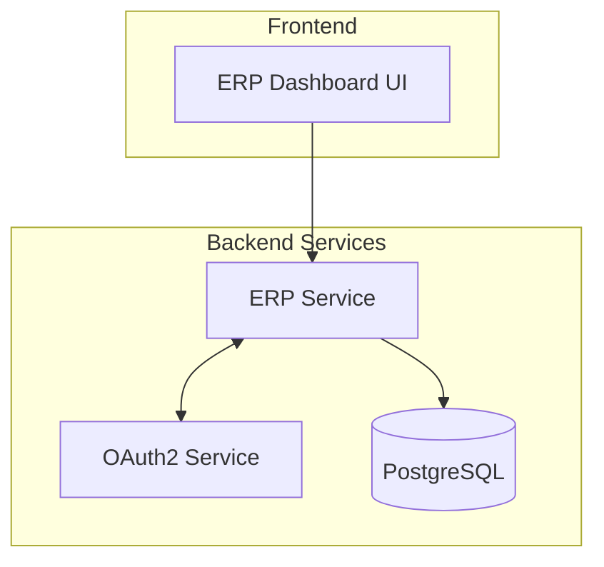
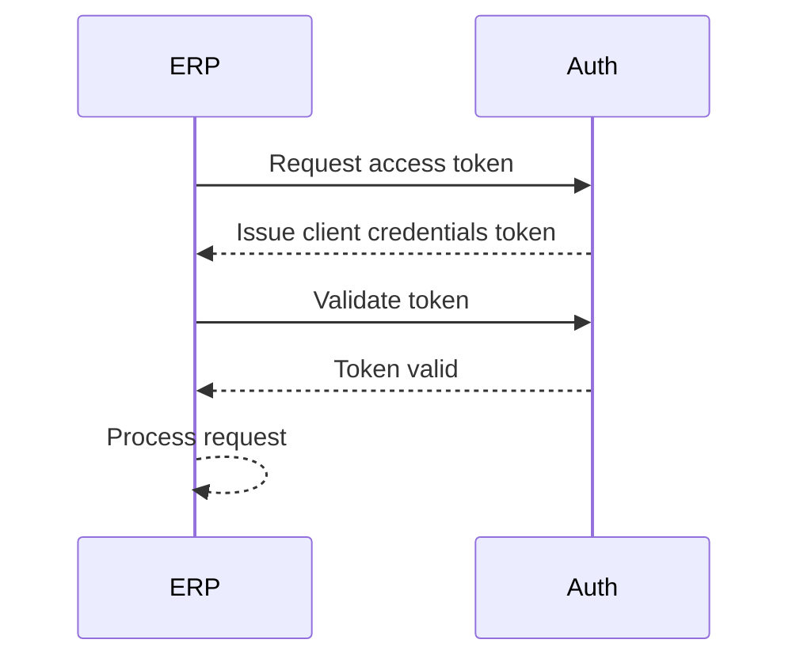

# Integration Plan: ERP Dashboard

## 1. Architecture Overview



## 2. Phased Integration Approach

### Phase 1: Infrastructure Setup (24hrs)
1. Implement OAuth2 service
2. Set up secure communication channels
3. Configure CORS and security headers
4. Establish monitoring and logging

### Phase 2: Core Integration (24hrs)
1. Create API contracts
2. Develop data exchange services
3. Add error handling

### Phase 3: Testing & Optimization (24hrs)
1. Unit and integration testing
2. Performance testing
3. Security audits
4. Documentation

## 3. Technical Specifications

### Authentication Flow


### API Contracts

1. ERP Data Request:
```typescript
interface ERPDataRequest {
  endpoint: string;
  method: 'GET' | 'POST';
  data?: {
    trainId?: string;
    scheduleId?: string;
    dateRange?: {
      start: string;
      end: string;
    };
  };
}
```

### Required Code Changes

1. Frontend Changes:
- `/src/components/Dashboard.tsx`: Update integration
- `/src/services/dataService.ts`: Update service endpoints

2. Backend Changes:
- `/backend/src/server.js`: Add ERP data handlers

### Security Implementation

1. OAuth2 Implementation:
- Client registration system
- Token generation and validation
- Scope-based access control
- Token refresh mechanism

2. Data Security:
- End-to-end encryption for sensitive data
- Input validation and sanitization
- Rate limiting
- Request signing

## 4. Performance Optimization

### Frontend Optimizations:
1. Response caching
2. Debounced/throttled API calls
3. Progressive loading indicators

### Backend Optimizations:
1. Connection pooling for DB
2. Response streaming
3. Cache layer for frequent queries
4. Batch processing for analytics

## 5. Testing Strategy

1. Unit Tests:
- Service endpoints
- Authentication flows
- Data transformation
- Error handling

2. Integration Tests:
- End-to-end flows
- API contract validation
- Performance benchmarks
- Security validations

3. Load Tests:
- Concurrent user simulation
- Response time monitoring
- Resource utilization checks
- Error rate monitoring

## 6. Implementation Timeline

Total Duration: 72 hours

### Day 1 (24hrs):
- Set up OAuth2 infrastructure
- Configure security measures
- Establish monitoring
- Begin API development

### Day 2 (24hrs):
- Complete dashboard integration
- Implement data exchange
- Set up error handling
- Begin testing suite

### Day 3 (24hrs):
- Complete testing
- Performance optimization
- Security audits
- Documentation and deployment

## 7. Constraints and Considerations

1. Dashboard Functionality:
- Maintain existing features
- Ensure backward compatibility
- Minimize disruption during integration

2. Timeline:
- 72-hour implementation window
- Phased rollout approach
- Critical path monitoring

## 8. Monitoring and Maintenance

1. System Health:
- API endpoint monitoring
- Error rate tracking
- Performance metrics
- Resource utilization

2. Security:
- Token validation logs
- Access attempt monitoring
- Rate limit tracking
- Security event alerts

3. Performance:
- Response time tracking
- Resource usage monitoring
- Cache hit rates
- Query performance
