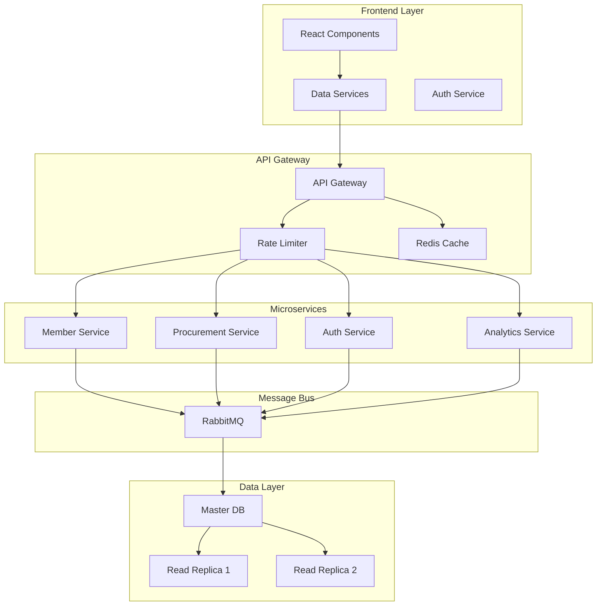

# TimeWise Procurement Dashboard - Architectural Improvements

## Overview

This document outlines a comprehensive plan for architectural improvements to the TimeWise Procurement Dashboard, focusing on system modularity, scalability, data flows, integration patterns, performance, and security.

## 1. System Modularity and Scalability

### Current Issues
- Monolithic architecture with tight coupling
- Direct database access through generic query endpoint
- Global database pool limiting scalability
- Limited error handling and retry logic

### Improvements

#### 1.1 Microservices Architecture
- **Priority**: High
- **Implementation Steps**:
  1. Create separate services for:
     - Member Management Service
     - Procurement Service
     - Authentication Service
     - Analytics Service
  2. Implement service discovery using Consul
  3. Add health checks and circuit breakers
  4. Deploy services in containers

#### 1.2 API Gateway
- **Priority**: High
- **Implementation Steps**:
  1. Implement API Gateway using Express Gateway
  2. Add request routing and load balancing
  3. Implement rate limiting
  4. Add request/response transformation
  5. Configure CORS and security headers

#### 1.3 Service Communication
- **Priority**: Medium
- **Implementation Steps**:
  1. Implement RabbitMQ message bus
  2. Add message serialization/deserialization
  3. Implement retry patterns
  4. Add dead letter queues
  5. Set up monitoring and alerting

## 2. Data Flow Improvements

### Current Issues
- Inefficient data fetching with fallback mechanisms
- No caching layer
- Synchronous blocking operations
- Limited data validation

### Improvements

#### 2.1 Caching Layer
- **Priority**: High
- **Implementation Steps**:
  1. Set up Redis caching service
  2. Implement cache-aside pattern
  3. Add cache invalidation strategies
  4. Configure TTL for different data types
  5. Add monitoring for cache hit/miss rates

#### 2.2 GraphQL API
- **Priority**: Medium
- **Implementation Steps**:
  1. Create GraphQL schema
  2. Implement resolvers
  3. Add DataLoader for batch loading
  4. Implement field-level permissions
  5. Add query complexity analysis

#### 2.3 Data Validation
- **Priority**: High
- **Implementation Steps**:
  1. Implement JSON Schema validation
  2. Add input sanitization
  3. Create custom validation rules
  4. Add validation middleware
  5. Implement error handling

## 3. Integration Patterns

### Current Issues
- Basic SSE implementation
- Limited error handling
- No circuit breakers
- Direct database queries

### Improvements

#### 3.1 Event-Driven Architecture
- **Priority**: High
- **Implementation Steps**:
  1. Define event schemas
  2. Implement event publishers
  3. Create event subscribers
  4. Add event validation
  5. Implement event sourcing

#### 3.2 Circuit Breakers
- **Priority**: Medium
- **Implementation Steps**:
  1. Implement Circuit Breaker pattern
  2. Add fallback mechanisms
  3. Configure thresholds
  4. Add monitoring and alerts
  5. Implement retry strategies

## 4. Performance Optimization

### Current Issues
- Large response payloads
- No request pagination
- Synchronous operations blocking event loop
- Limited connection pooling

### Improvements

#### 4.1 Response Optimization
- **Priority**: High
- **Implementation Steps**:
  1. Implement compression middleware
  2. Add response pagination
  3. Enable field filtering
  4. Implement partial responses
  5. Add ETag support

#### 4.2 Database Optimization
- **Priority**: High
- **Implementation Steps**:
  1. Implement read replicas
  2. Optimize indexes
  3. Add query caching
  4. Implement connection pooling
  5. Add query monitoring

#### 4.3 Asynchronous Processing
- **Priority**: Medium
- **Implementation Steps**:
  1. Identify CPU-intensive tasks
  2. Implement worker threads
  3. Add job queues
  4. Implement background processing
  5. Add progress tracking

## 5. Security Architecture

### Current Issues
- Basic authentication
- No rate limiting
- Exposed database queries
- CORS configuration needs improvement

### Improvements

#### 5.1 Authentication & Authorization
- **Priority**: High
- **Implementation Steps**:
  1. Implement OAuth2/OpenID Connect
  2. Add role-based access control
  3. Implement JWT handling
  4. Add token refresh mechanism
  5. Implement session management

#### 5.2 API Security
- **Priority**: High
- **Implementation Steps**:
  1. Implement rate limiting
  2. Add request throttling
  3. Configure security headers
  4. Implement CORS policies
  5. Add API key management

#### 5.3 Data Security
- **Priority**: High
- **Implementation Steps**:
  1. Implement data encryption
  2. Add audit logging
  3. Implement secure error handling
  4. Add SQL injection prevention
  5. Implement data masking

## Implementation Timeline

### Phase 1 (1-2 months)
- Implement API Gateway
- Add caching layer
- Implement basic authentication improvements
- Add initial microservices structure

### Phase 2 (2-3 months)
- Complete microservices migration
- Implement event-driven architecture
- Add GraphQL API
- Implement database optimizations

### Phase 3 (2-3 months)
- Complete security improvements
- Add performance optimizations
- Implement monitoring and alerting
- Complete integration patterns

## Expected Outcomes

1. **Improved Scalability**
   - Better resource utilization
   - Easier horizontal scaling
   - Improved fault isolation

2. **Better Performance**
   - Reduced response times
   - Improved data access patterns
   - Better handling of concurrent users

3. **Enhanced Security**
   - Robust authentication/authorization
   - Better data protection
   - Improved API security

4. **Maintainability**
   - Clearer service boundaries
   - Better error handling
   - Improved monitoring and debugging

## Monitoring and Success Metrics

1. **Performance Metrics**
   - Response time percentiles
   - Error rates
   - Cache hit/miss rates
   - Database query performance

2. **Scalability Metrics**
   - Resource utilization
   - Service uptime
   - Recovery time objectives
   - Concurrent user handling

3. **Security Metrics**
   - Failed authentication attempts
   - Rate limit breaches
   - Security incident response time
   - Vulnerability assessment scores